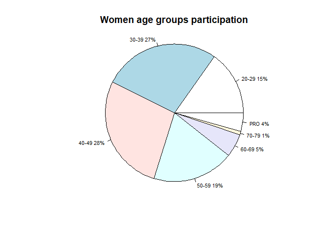

IRONMAN WORLD CHAMPIONSHIPS HAWAII 2015 (2.4 mil swim, 112 mil bike and
26.2 mil run, altogether 140.6 miles)
================
Project created by Grzegorz Kryzia during the course Exploratory Data
Analysis and Visualization at UCLA Extension (11/2020)


## Analysis of dataset obtained on Academic Torrents website <http://academictorrents.com>. It answers following questions:

1.  How do age and gender impact overall time and times of individual
    disciplines?
2.  Which age groups among each gender are the most competitive?
3.  Do older athletes always have the longer time to complete the race?
4.  What age groups are most numerous?
5.  How does time of one discipline impact an overall time?

## Original dataset file structure (2309 observations, 20 columns)

-   Name
-   GenderRank
-   DivRank
-   OverallRank
-   Division
-   Bib
-   Age
-   State
-   Country
-   Profession
-   Points
-   Swim time
-   SwimDistance
-   T1- transition time
-   Bike time
-   BikeDistance
-   T2 – transition time
-   Run time
-   RunDistance
-   Overall time

#### *Loading libraries*

``` r
packages = c("plotrix", "lubridate", "rmarkdown")

lapply(
  packages,
  FUN = function(x) {
    if (!require(x, character.only = TRUE)) {
      install.packages(x, dependencies = TRUE)
      library(x, character.only = TRUE)
    }
  }
)
```

    ## Loading required package: plotrix

    ## Loading required package: lubridate

    ## 
    ## Attaching package: 'lubridate'

    ## The following objects are masked from 'package:base':
    ## 
    ##     date, intersect, setdiff, union

    ## Loading required package: rmarkdown

    ## [[1]]
    ## NULL
    ## 
    ## [[2]]
    ## NULL
    ## 
    ## [[3]]
    ## NULL

#### *Loading dataset*

``` r
imdata <- read.csv("im_world-championships_2015.csv")
dim(imdata)
```

    ## [1] 2308   20

``` r
head(imdata)
```

    ##                name genderRank divRank overallRank bib division age state
    ## 1       Jan Frodeno          1       1           1   2      PRO  35   ---
    ## 2   Andreas Raelert          2       2           2  35      PRO  40   ---
    ## 3     Tim O'Donnell          3       3           3  21      PRO  35    CO
    ## 4        Andy Potts          4       4           4   5      PRO  39    CO
    ## 5 Tyler Butterfield          5       5           5  29      PRO  33    CO
    ## 6     Cyril Viennot          6       6           6  16      PRO  34   ---
    ##   country profession points     swim swimDistance       t1     bike
    ## 1     DEU        ---   5000 00:50:50       2.4 mi 00:01:51 04:27:27
    ## 2     DEU        ---   4963 00:52:24       2.4 mi 00:01:56 04:30:52
    ## 3     USA        ---   4950 00:52:24       2.4 mi 00:02:01 04:26:13
    ## 4     USA        ---   4919 00:50:56       2.4 mi 00:01:43 04:32:41
    ## 5     BMU        ---   4898 00:52:33       2.4 mi 00:02:01 04:29:35
    ## 6     FRA        ---   4875 00:52:35       2.4 mi 00:02:19 04:34:27
    ##   bikeDistance       t2      run runDistance  overall
    ## 1       112 mi 00:02:11 02:52:21     26.2 mi 08:14:40
    ## 2       112 mi 00:02:29 02:50:02     26.2 mi 08:17:43
    ## 3       112 mi 00:02:26 02:55:46     26.2 mi 08:18:50
    ## 4       112 mi 00:02:20 02:53:45     26.2 mi 08:21:25
    ## 5       112 mi 00:02:41 02:56:19     26.2 mi 08:23:09
    ## 6       112 mi 00:02:39 02:53:05     26.2 mi 08:25:05

``` r
summary(imdata)
```

    ##      name            genderRank          divRank          overallRank       
    ##  Length:2308        Length:2308        Length:2308        Length:2308       
    ##  Class :character   Class :character   Class :character   Class :character  
    ##  Mode  :character   Mode  :character   Mode  :character   Mode  :character  
    ##                                                                             
    ##                                                                             
    ##                                                                             
    ##       bib           division             age               state          
    ##  Min.   :   1.0   Length:2308        Length:2308        Length:2308       
    ##  1st Qu.: 644.8   Class :character   Class :character   Class :character  
    ##  Median :1241.5   Mode  :character   Mode  :character   Mode  :character  
    ##  Mean   :1239.7                                                           
    ##  3rd Qu.:1838.2                                                           
    ##  Max.   :2425.0                                                           
    ##    country           profession           points              swim          
    ##  Length:2308        Length:2308        Length:2308        Length:2308       
    ##  Class :character   Class :character   Class :character   Class :character  
    ##  Mode  :character   Mode  :character   Mode  :character   Mode  :character  
    ##                                                                             
    ##                                                                             
    ##                                                                             
    ##  swimDistance            t1                bike           bikeDistance      
    ##  Length:2308        Length:2308        Length:2308        Length:2308       
    ##  Class :character   Class :character   Class :character   Class :character  
    ##  Mode  :character   Mode  :character   Mode  :character   Mode  :character  
    ##                                                                             
    ##                                                                             
    ##                                                                             
    ##       t2                run            runDistance          overall         
    ##  Length:2308        Length:2308        Length:2308        Length:2308       
    ##  Class :character   Class :character   Class :character   Class :character  
    ##  Mode  :character   Mode  :character   Mode  :character   Mode  :character  
    ##                                                                             
    ##                                                                             
    ## 

``` r
names(imdata)
```

    ##  [1] "name"         "genderRank"   "divRank"      "overallRank"  "bib"         
    ##  [6] "division"     "age"          "state"        "country"      "profession"  
    ## [11] "points"       "swim"         "swimDistance" "t1"           "bike"        
    ## [16] "bikeDistance" "t2"           "run"          "runDistance"  "overall"

## 1. Cleaning data

##### *Removing columns “State” in which there are many missing values and “Profession” in which there are no values at all*

``` r
## Removing columns "State" (many missing values) and "Profession" (no values at all) 
imdata <- imdata[,c(-8,-10)]
```

##### *Removing rows with overallRank DNS (Did not start), DNF (Did not finish) and DQ (Disqualified)*

``` r
rows_to_remove <- imdata$overallRank=="DNS" | imdata$overallRank=="DNF" | imdata$overallRank=="DQ"
imdata <- imdata[!rows_to_remove,]
```

##### *Converting to numbers columns genderRank, divRank, overallRank, age*

``` r
genderRank_n <- as.numeric(imdata$genderRank)
imdata$genderRank <- genderRank_n

divRank_n <- as.numeric(imdata$divRank)
imdata$divRank <- divRank_n

overallRank_n <- as.numeric(imdata$overallRank)
imdata$overallRank <- overallRank_n

age_n <- as.numeric(imdata$age)
```

    ## Warning: NAs introduced by coercion

``` r
imdata$age <- age_n

summary(imdata)
```

    ##      name             genderRank        divRank        overallRank    
    ##  Length:2143        Min.   :   1.0   Min.   :  1.00   Min.   :   1.0  
    ##  Class :character   1st Qu.: 268.5   1st Qu.: 24.00   1st Qu.: 536.5  
    ##  Mode  :character   Median : 536.0   Median : 56.00   Median :1072.0  
    ##                     Mean   : 642.6   Mean   : 77.53   Mean   :1072.0  
    ##                     3rd Qu.:1013.5   3rd Qu.:118.00   3rd Qu.:1607.5  
    ##                     Max.   :1549.0   Max.   :283.00   Max.   :2143.0  
    ##                                                                       
    ##       bib           division              age          country         
    ##  Min.   :   1.0   Length:2143        Min.   :20.00   Length:2143       
    ##  1st Qu.: 707.5   Class :character   1st Qu.:35.00   Class :character  
    ##  Median :1284.0   Mode  :character   Median :43.00   Mode  :character  
    ##  Mean   :1276.0                      Mean   :43.18                     
    ##  3rd Qu.:1855.5                      3rd Qu.:51.00                     
    ##  Max.   :2425.0                      Max.   :76.00                     
    ##                                      NA's   :23                        
    ##     points              swim           swimDistance            t1           
    ##  Length:2143        Length:2143        Length:2143        Length:2143       
    ##  Class :character   Class :character   Class :character   Class :character  
    ##  Mode  :character   Mode  :character   Mode  :character   Mode  :character  
    ##                                                                             
    ##                                                                             
    ##                                                                             
    ##                                                                             
    ##      bike           bikeDistance            t2                run           
    ##  Length:2143        Length:2143        Length:2143        Length:2143       
    ##  Class :character   Class :character   Class :character   Class :character  
    ##  Mode  :character   Mode  :character   Mode  :character   Mode  :character  
    ##                                                                             
    ##                                                                             
    ##                                                                             
    ##                                                                             
    ##  runDistance          overall         
    ##  Length:2143        Length:2143       
    ##  Class :character   Class :character  
    ##  Mode  :character   Mode  :character  
    ##                                       
    ##                                       
    ##                                       
    ## 

#### *Dealing with NA’s in age column. There is 23 NA’s values in age, I could remove those rows but I fill them with median value of a division the person belongs to, which is like an age group with span of 5 years*

``` r
nrow(imdata[is.na(imdata$age),])
```

    ## [1] 23

``` r
# Function fixAge returns median age for division e.g. fixAge("30-34") returns 32
fixAge <- function(division) {
  div <- strsplit(division, "-")  # strsplit returns a list of the same length as parameter passed to it
  return( median(as.numeric(div[[1]][1]) : as.numeric(div[[1]][2])) )
}

imdata$age[is.na(imdata$age)] <- sapply(imdata$division[is.na(imdata$age)], fixAge)

summary(imdata$age) # Now there are no NA's in age column
```

    ##    Min. 1st Qu.  Median    Mean 3rd Qu.    Max. 
    ##   20.00   35.00   43.00   43.22   51.00   76.00

#### *Creating “gender” variable based on existing genderRank variable*

``` r
# Ordering data by genderRank and overallRank
imdata <- imdata[order(imdata$genderRank, imdata$overallRank),]

# Checking for what places in genderRank are 2 entries
double_genderRank <- table(imdata$genderRank)[table(imdata$genderRank)==2] ## Only those with 2 entries
length(double_genderRank)
```

    ## [1] 594

``` r
#  From the data SORTED BY data$genderRank and data$overallRank we see that up to 594 place (genderRank)
#  every place in genderRank appears twice, for male and female. Looking at overallRank and the differences
#  in ranks between male and female ranks and choosing this column overallRank as a second column in ordering, every #  second row up to 594 place (genderRank) is a female. Starting from 595 place there are only males
#  So for first 594*2=1188 rows we have rows in order male, female, male, female .... up to 1188 row

gender <- c()
gender[imdata$genderRank > 594] <- "M"

length(gender)
```

    ## [1] 2143

``` r
length(gender[is.na(gender)])
```

    ## [1] 1188

``` r
# Filling gender vector, indices 1 - 1188 (2*594) in order (male, female)
gender[1:1188] <- "M"      # temporarily all from this range to M
gender[2 * 1:594] <- "F"

imdata <- cbind(imdata[,], gender)
imdata <- imdata[,c(1,19,2:18)] # moving gender column to the 2nd position           
```

#### *Utilizing lubridate library to convert time variables, for each time variable I add two additional variables with suffix \_hms (object hms from lubridate library - internally time stored as the number of seconds since 00:00:00) and with suffix \_sec (numeric value, number of seconds). Example: for variable swim I add variables swim\_hms and swim\_sec.*

``` r
swim_hms <- c()
swim_hms <- hms(imdata$swim)
imdata <- cbind(imdata,swim_hms)
swim_sec <- c()
swim_sec <- as.numeric(imdata$swim_hms)
imdata <- cbind(imdata,swim_sec)
# summary(imdata$swim_hms)

bike_hms <- c()
bike_hms <- hms(imdata$bike)
imdata <- cbind(imdata,bike_hms)
bike_sec <- c()
bike_sec <- as.numeric(imdata$bike_hms)
imdata <- cbind(imdata,bike_sec)
# summary(imdata$bike_hms)

run_hms <- c()
run_hms <- hms(imdata$run)
imdata <- cbind(imdata,run_hms)
run_sec <- c()
run_sec <- as.numeric(imdata$run_hms)
imdata <- cbind(imdata,run_sec)
# summary(imdata$run_hms)

t1_hms <- c()
t1_hms <- hms(imdata$t1)
imdata <- cbind(imdata,t1_hms)
t1_sec <- c()
t1_sec <- as.numeric(imdata$t1_hms)
imdata <- cbind(imdata,t1_sec)
# summary(imdata$t1_hms)

t2_hms <- c()
t2_hms <- hms(imdata$t2)
imdata <- cbind(imdata,t2_hms)
t2_sec <- c()
t2_sec <- as.numeric(imdata$t2_hms)
imdata <- cbind(imdata,t2_sec)
# summary(imdata$t2_hms)

overall_hms <- c()
overall_hms <- hms(imdata$overall)
imdata <- cbind(imdata,overall_hms)
overall_sec <- c()
overall_sec <- as.numeric(imdata$overall_hms)
imdata <- cbind(imdata,overall_sec)
# summary(imdata$overall_hms)
```

#### *Creating a factor on the gender variable and shifting columns*

``` r
imdata$gender<-as.factor(imdata$gender)
imdata <- imdata[,c(1:11,20:21,12:13,26:27,14,22:23,15:16,28:29,17,24:25,18:19,30:31)]
names(imdata)
```

    ##  [1] "name"         "gender"       "genderRank"   "divRank"      "overallRank" 
    ##  [6] "bib"          "division"     "age"          "country"      "points"      
    ## [11] "swim"         "swim_hms"     "swim_sec"     "swimDistance" "t1"          
    ## [16] "t1_hms"       "t1_sec"       "bike"         "bike_hms"     "bike_sec"    
    ## [21] "bikeDistance" "t2"           "t2_hms"       "t2_sec"       "run"         
    ## [26] "run_hms"      "run_sec"      "runDistance"  "overall"      "overall_hms" 
    ## [31] "overall_sec"

#### *Creating variable division\_y10 with divisions span 10 years (original variable division has span of 5 years)*

``` r
table(imdata$division)
```

    ## 
    ## 18-24 25-29 30-34 35-39 40-44 45-49 50-54 55-59 60-64 65-69 70-74 75-79    PC 
    ##    81   165   248   313   365   331   257   154    82    47    25     3     8 
    ##   PRO 
    ##    64

``` r
division_y10 <- c()
division_y10[imdata$division=="PRO"] <- "PRO"
division_y10[imdata$division=="PC"] <- "PC"
division_y10[imdata$division=="18-24" | imdata$division=="25-29"] <- "20-29"
division_y10[imdata$division=="30-34" | imdata$division=="35-39"] <- "30-39"
division_y10[imdata$division=="40-44" | imdata$division=="45-49"] <- "40-49"
division_y10[imdata$division=="50-54" | imdata$division=="55-59"] <- "50-59"
division_y10[imdata$division=="60-64" | imdata$division=="65-69"] <- "60-69"
division_y10[imdata$division=="70-74" | imdata$division=="75-79"] <- "70-79"

imdata <- cbind(imdata[,1:7], division_y10, imdata[8:31])
dim(imdata) # 2143 32
```

    ## [1] 2143   32

## 2. Data Analysis and Visualization

``` r
# Count of competitors by gender
gender_count <- with(imdata, table(gender))
barplot(gender_count, ylab = "Count", xlab="Gender", names.arg=c('Female','Male'), 
        cex.main=1.2, cex.lab = 1, cex.axis = 1, cex.names = 1,
        col = c("cornflowerblue","brown3"), main = "Count of competitors by gender", ylim= c(0,1700))
```

<!-- -->

``` r
## Count of competitors by gender in percent
gender_tab <- table(imdata$gender)
lbls <- paste(names(gender_tab), "", sep="\t")
pct <- round(gender_tab/sum(gender_tab)*100)    # percentage
lbls <- paste(lbls, pct)                        # adding percents to labels
lbls <- paste(lbls,"%",sep="")

pie3D(gender_tab,labels = lbls, explode = 0.05, col=c("cornflowerblue","brown3"),
labelcex = 1.1, radius = 1, main = "Participation by gender", cex.main=1.2)
```

<!-- -->

------------------------------------------------------------------------

> -   #### More than 2/3 participants are males

------------------------------------------------------------------------

``` r
# Men participation by age group
div_males <- table(imdata$division_y10[gender=='M'])
lbls <- paste(names(div_males), "", sep="\t")
pct <- round(div_males/sum(div_males)*100)
lbls <- paste(lbls, pct) # add percents to labels 
lbls <- paste(lbls,"%",sep="") # ad % to labels 

pie(div_males, labels = lbls,  radius=1, cex=0.7,
    main="Men age groups participation") 
```

<!-- -->

``` r
# Women participation by age group
div_females <- table(imdata$division_y10[gender=='F'])
lbls <- paste(names(div_females), "", sep="\t")
pct <- round(div_females/sum(div_females)*100)
lbls <- paste(lbls, pct) # add percents to labels 
lbls <- paste(lbls,"%",sep="") # ad % to labels 

pie(div_females, labels = lbls,  radius=1, cex=0.7,
    main="Women age groups participation") 
```

<!-- -->

------------------------------------------------------------------------

> -   #### The most numerous age group of participants is 40-49, 34% for men and 28% for women
>
> -   #### The younger groups 20-29 is for both men and women only on 4th position and is three times smaller than men group 40-49 and almost two times smaller than women group 40-49

------------------------------------------------------------------------

``` r
summary(imdata$overall_hms[imdata$gender=='M'])
```

    ##                        Min.                     1st Qu. 
    ##                "8H 14M 40S"                "10H 9M 13S" 
    ##                      Median                        Mean 
    ##               "10H 50M 18S" "11H 27M 3.91930277598294S" 
    ##                     3rd Qu.                        Max. 
    ##               "12H 22M 15S"               "16H 43M 38S"

``` r
summary(imdata$overall_hms[imdata$gender=='F'])
```

    ##                        Min.                     1st Qu. 
    ##                "8H 57M 57S"            "11H 15M 40.25S" 
    ##                      Median                        Mean 
    ##              "12H 7M 42.5S" "12H 22M 10.5437710437691S" 
    ##                     3rd Qu.                        Max. 
    ##              "13H 7M 35.5S"               "16H 49M 24S"

``` r
# Overall time by gender 
boxplot(imdata$overall_sec~imdata$gender, col = c("cornflowerblue","brown3"), xlab = "Time [s]", ylab = "Gender",
        main = "Overall time by gender", cex = 0.4, horizontal = T )
```

<!-- -->

------------------------------------------------------------------------

> -   #### Overall time of women is spread quite normally with median 12:07H
>
> -   #### Distribution of overall men time is right skewed with median 10:50H. Almost 75% of men have overall time below or close to women’s median.

------------------------------------------------------------------------

``` r
# Overall time - men by age group and professionals 
men_only <- imdata[imdata$gender=='M', ]
boxplot(overall_sec~division_y10, data=men_only, col = "brown3", xlab = "Time [s]", ylab = "Age group",
        main = "Overall time - men by age group and professionals", cex = 0.4, horizontal=T)
```

<!-- -->

------------------------------------------------------------------------

> -   #### In men groups one of the interesting insights is the competition between the two groups, 20-29 and 30-39. The range of most of the times of the group 30-39 is lower than the range of times of the group 20-29. The 30-39 group’s median time is also lower than the median of the group 20-29.

------------------------------------------------------------------------

### Comparing two men groups 20-29 vs. 30-39

``` r
# Creating a variable men_20_39 with two men age groups "20-29" and "30-39"
men_20_39 = men_only[men_only$division_y10=="20-29" | men_only$division_y10=="30-39",]

# Computing averages (means) values for both age groups
overall_means <- aggregate(overall_sec ~ division_y10, data = men_20_39, FUN = mean)
swim_means <- aggregate(swim_sec ~ division_y10, data = men_20_39, FUN = mean)
bike_means <- aggregate(bike_sec ~ division_y10, data = men_20_39, FUN = mean)
run_means <- aggregate(run_sec ~ division_y10, data = men_20_39, FUN = mean)
```

``` r
# Generating barplots for means
par(mfrow = c(2,2))

bp <- barplot(overall_means$overall_sec, ylab = "Average overall time", main = "Overall time",
        names.arg = c("20-29","30-39"), col = c("red","blue"), ylim=c(0,40000), space=0)
text(bp, 0, round(overall_means$overall_sec),cex=1,pos=3) 

bp <- barplot(swim_means$swim_sec, ylab = "Average swim time", main = "Swim time",
        names.arg = c("20-29","30-39"), col = c("red","blue"), ylim=c(0,4200), space=0)
text(bp, 0, round(swim_means$swim_sec),cex=1,pos=3) 

bp <- barplot(bike_means$bike_sec, ylab = "Average bike time", main = "Bike time",
        names.arg = c("20-29","30-39"), col = c("red","blue"), ylim=c(0,20000), space=0)
text(bp, 0, round(bike_means$bike_sec),cex=1,pos=3) 

bp <- barplot(run_means$run_sec, ylab = "Average run time", main = "Run time",
        names.arg = c("20-29","30-39"), col = c("red","blue"), ylim=c(0,15000), space=0)
text(bp, 0, round(run_means$run_sec),cex=1,pos=3) 
```

<!-- -->

------------------------------------------------------------------------

> -   #### The average overall time as well as the average bike time and run time is lower for the group 30-39. Only in swimming the group 20-29 has lower average time.

------------------------------------------------------------------------

``` r
## Overlaying histograms with density plots - group "20-29" vs "30-39"
par(mfrow = c(1,1))

## Overall time with density plots - group men "20-29" vs men "30-39"
hist(men_only$overall_sec[men_only$division_y10=="30-39"], freq = F, label=F,
     breaks = seq(28000,61000,1800),  xlim = c(28000,61000), ylim = c(0,0.0002), col=rgb(0,1,0,0.2),
     main = "Overall time - men 20-29, 30-39", xlab = "Overall time [s]")
legend("topright", c("30-39", "20-29"), col=c(rgb(0,1,0,0.2),rgb(0,0,1,0.2)), lwd=3, cex=0.7)

hist(men_only$overall_sec[men_only$division_y10=="20-29"], freq = F, label=F, add=T,
     breaks = seq(28000,61000,1800),  xlim = c(28000,61000), ylim = c(0,0.0002), col=rgb(0,0,1,0.2),
     main = "Overall time - men 20-29, 30-39",
     xlab = "Overall time [s]")

dens_30_39 <- density(men_only$overall_sec[men_only$division_y10=="30-39"], bw = 1800)
dens_20_29 <- density(men_only$overall_sec[men_only$division_y10=="20-29"], bw = 1800)

lines(dens_30_39, lwd = 2, col = "darkgreen", lty = 5)
lines(dens_20_29, lwd = 2, col = "purple", lty = 4)
```

<!-- -->

``` r
## Swim time with density plots - group men "20-29" vs men "30-39"

hist(men_only$swim_sec[men_only$division_y10=="30-39"], freq = F, label=F,
     breaks = seq(2500,7000,300),  xlim = c(2500,7000), ylim = c(0,0.001), col=rgb(0,1,0,0.2),
     main = "Swim time - men 20-29, 30-39", xlab = "Swim time [s]")

hist(men_only$swim_sec[men_only$division_y10=="20-29"], freq = F, label=F, add=T,
     breaks = seq(2500,7000,300),  xlim = c(2500,7000), ylim = c(0,0.001), col=rgb(0,0,1,0.2),
     main = "Swim time - men 20-29, 30-39",
     xlab = "Swim time [s]")

legend("topright", c("30-39", "20-29"), col=c(rgb(0,1,0,0.2),rgb(0,0,1,0.2)), lwd=3, cex=0.7)

dens_30_39 <- density(men_only$swim_sec[men_only$division_y10=="30-39"], bw = 220)
dens_20_29 <- density(men_only$swim_sec[men_only$division_y10=="20-29"], bw = 220)

lines(dens_30_39, lwd = 2, col = "darkgreen", lty = 5)
lines(dens_20_29, lwd = 2, col = "purple", lty = 4)
```

<!-- -->

------------------------------------------------------------------------

> -   #### The swim time of group 30-39 is spread over the wider range, still a little skewed but not as much as for the group 20-29 for which most times are concentrated below 4000 sec.

------------------------------------------------------------------------

``` r
## Bike time with density plots - group men "20-29" vs men "30-39"

hist(men_only$bike_sec[men_only$division_y10=="30-39"], freq = F, label=F,
     breaks = seq(16200,30000,900),  xlim = c(16000,30000), ylim = c(0,0.0004), col=rgb(0,1,0,0.2),
     main = "Bike time - men 20-29, 30-39", xlab = "Bike time [s]")

hist(men_only$bike_sec[men_only$division_y10=="20-29"], freq = F, label=F, add=T,
     breaks = seq(16200,30000,900),  xlim = c(16000,30000), ylim = c(0,0.0004), col=rgb(0,0,1,0.2),
     main = "Bike time - men 20-29, 30-39",
     xlab = "Bike time [s]")

legend("topright", c("30-39", "20-29"), col=c(rgb(0,1,0,0.2),rgb(0,0,1,0.2)), lwd=3, cex=0.7)

dens_30_39 <- density(men_only$bike_sec[men_only$division_y10=="30-39"], bw = 900)
dens_20_29 <- density(men_only$bike_sec[men_only$division_y10=="20-29"], bw = 900)

lines(dens_30_39, lwd = 2, col = "darkgreen", lty = 5)
lines(dens_20_29, lwd = 2, col = "purple", lty = 4)
```

<!-- -->

------------------------------------------------------------------------

> -   #### The spread of the bike time for both groups looks similar with a little advantage of group 30-39 in the lowest times 16000 - 17000 sec and between 18000 - 19000 sec

------------------------------------------------------------------------

``` r
## Run time with density plots - group men "20-29" vs men "30-39"

hist(men_only$run_sec[men_only$division_y10=="30-39"], freq = F, label=F,
     breaks = seq(10600,28800,900),  xlim = c(10600,28800), ylim = c(0,0.0004), col=rgb(0,1,0,0.2),
     main = "Run time - men 20-29, 30-39", xlab = "Run time [s]")

hist(men_only$run_sec[men_only$division_y10=="20-29"], freq = F, label=F, add=T,
     breaks = seq(10600,28800,900),  xlim = c(10600,28800), ylim = c(0,0.0004), col=rgb(0,0,1,0.2),
     main = "Run time - men 20-29, 30-39",
     xlab = "Run time [s]")

legend("topright", c("30-39", "20-29"), col=c(rgb(0,1,0,0.2),rgb(0,0,1,0.2)), lwd=3, cex=0.7)

dens_30_39 <- density(men_only$run_sec[men_only$division_y10=="30-39"], bw = 900)
dens_20_29 <- density(men_only$run_sec[men_only$division_y10=="20-29"], bw = 900)

lines(dens_30_39, lwd = 2, col = "darkgreen", lty = 5)
lines(dens_20_29, lwd = 2, col = "purple", lty = 4)
```

<!-- -->

------------------------------------------------------------------------

> -   #### Looking at the distributions of run times for both groups, we can see that the difference between times is bigger, compared to bike time, in favor of the group 30-39. For both group distribution is right skewed, but it can be clearly seen that for the group 30-39 by far more data is concentrated in lower range than for the group 20-29.

------------------------------------------------------------------------

### Checking the correlation of men bike time in all age groups and their overall time

``` r
plot(men_only$bike_sec[men_only$division_y10=="20-29"], men_only$overall_sec[men_only$division_y10=="20-29"],
     main = "Overall time and bike time for men", 
     ylim = c(28000,60500), xlim = c(15000,31000), xlab = "Bike time [s]", 
     ylab = "Overall time [s]", pch = 17, col = "red")

legend("bottomright", c("20-29", "30-39", "40-49", "50-59", "60-69", "70-79"), 
       col = c("red", "blue2", "cyan4", "darkgreen", "gray50", "purple"),pch = c(17:21,15))
```

<!-- -->
<!-- -->
<!-- -->
<!-- -->
<!-- -->

``` r
plot(men_only$bike_sec[men_only$division_y10=="20-29"], men_only$overall_sec[men_only$division_y10=="20-29"],
      main = "Overall time and bike time for men", 
      ylim = c(28000,60500), xlim = c(15000,31000), xlab = "Bike time [s]", 
      ylab = "Overall time [s]", pch = 17, col = "red")

legend("bottomright", c("20-29", "30-39", "40-49", "50-59", "60-69", "70-79"), 
        col = c("red", "blue2", "cyan4", "darkgreen", "gray50", "purple"),pch = c(17:21,15))
 
points(men_only$bike_sec[men_only$division_y10=="30-39"], men_only$overall_sec[men_only$division_y10=="30-39"],
        pch = 18, col = "blue2")
 
points(men_only$bike_sec[men_only$division_y10=="40-49"], men_only$overall_sec[men_only$division_y10=="40-49"],
        pch = 19, col = "cyan4")
 
points(men_only$bike_sec[men_only$division_y10=="50-59"], men_only$overall_sec[men_only$division_y10=="50-59"],
        pch = 20, col = "darkgreen")
 
points(men_only$bike_sec[men_only$division_y10=="60-69"], men_only$overall_sec[men_only$division_y10=="60-69"],
        pch = 21, col = "gray50")
 
points(men_only$bike_sec[men_only$division_y10=="70-79"], men_only$overall_sec[men_only$division_y10=="70-79"],
        pch = 15, col = "purple")
```

<!-- -->

### Building linear regression model

``` r
## Building linear regression model
model_bike <- lm(overall_sec ~ bike_sec, data=men_only)
model_bike
```

    ## 
    ## Call:
    ## lm(formula = overall_sec ~ bike_sec, data = men_only)
    ## 
    ## Coefficients:
    ## (Intercept)     bike_sec  
    ##   -4586.284        2.234

``` r
summary(model_bike)
```

    ## 
    ## Call:
    ## lm(formula = overall_sec ~ bike_sec, data = men_only)
    ## 
    ## Residuals:
    ##      Min       1Q   Median       3Q      Max 
    ## -12169.2  -1404.8   -295.2   1077.6  14983.8 
    ## 
    ## Coefficients:
    ##               Estimate Std. Error t value Pr(>|t|)    
    ## (Intercept) -4.586e+03  4.437e+02  -10.34   <2e-16 ***
    ## bike_sec     2.234e+00  2.145e-02  104.17   <2e-16 ***
    ## ---
    ## Signif. codes:  0 '***' 0.001 '**' 0.01 '*' 0.05 '.' 0.1 ' ' 1
    ## 
    ## Residual standard error: 2325 on 1547 degrees of freedom
    ## Multiple R-squared:  0.8752, Adjusted R-squared:  0.8751 
    ## F-statistic: 1.085e+04 on 1 and 1547 DF,  p-value: < 2.2e-16

``` r
## Adding the regression line to the graph
plot(men_only$bike_sec[men_only$division_y10=="20-29"], men_only$overall_sec[men_only$division_y10=="20-29"],
      main = "Overall time and bike time for men", 
      ylim = c(28000,60500), xlim = c(15000,31000), xlab = "Bike time [s]", 
      ylab = "Overall time [s]", pch = 17, col = "red")

legend("bottomright", c("20-29", "30-39", "40-49", "50-59", "60-69", "70-79"), 
        col = c("red", "blue2", "cyan4", "darkgreen", "gray50", "purple"),pch = c(17:21,15))
 
points(men_only$bike_sec[men_only$division_y10=="30-39"], men_only$overall_sec[men_only$division_y10=="30-39"],
        pch = 18, col = "blue2")
 
points(men_only$bike_sec[men_only$division_y10=="40-49"], men_only$overall_sec[men_only$division_y10=="40-49"],
        pch = 19, col = "cyan4")
 
points(men_only$bike_sec[men_only$division_y10=="50-59"], men_only$overall_sec[men_only$division_y10=="50-59"],
        pch = 20, col = "darkgreen")
 
points(men_only$bike_sec[men_only$division_y10=="60-69"], men_only$overall_sec[men_only$division_y10=="60-69"],
        pch = 21, col = "gray50")
 
points(men_only$bike_sec[men_only$division_y10=="70-79"], men_only$overall_sec[men_only$division_y10=="70-79"],
        pch = 15, col = "purple")


abline(model_bike, col = "orange3", lty = 1, lwd = 3)
text(16000,30000,labels = "Y = -4586.284 + 2.234X", adj = 0, col="orange3")
```

<!-- -->

------------------------------------------------------------------------

> -   #### The regression equation is Y = -4586.284 + 2.234X
>
> -   #### There is a positive correlation between bike time variable and overall time variable
>
> -   #### The coefficients are -4586.284 (intercept) and 2.234 (slope), both coefficients are significant which we can tell from model’s summary
>
> -   #### The interpretation of regression equation is: if bike\_sec increases by 1, then overall\_sec increases by 2.234
>
> -   #### In other words the model predicts increase in overall time about twice as much as increase in bike time
>
> -   #### Every increase by 60 sec in bike time causes increase by 120 sec in overall time,
>
> -   #### every increase by 5 min (300 sec) in bike time causes increase by 10 min (600 sec) in overall time
>
> -   #### On the other hand decreasing your bike time by 5 min can help you decrease your overall time by 10 min !!!

------------------------------------------------------------------------

``` r
par(mfrow = c(2,1))

# summary(imdata$t1_sec)
boxplot(imdata$t1_sec~imdata$gender, horizontal=T, ylim=c(0,1000), 
        col = c("cornflowerblue","brown3"), xlab = "Time [s]", ylab = "Gender",
        main = "Transition time T1 (swim/bike) by gender", cex = 0.4 )

# summary(imdata$t2_sec)
boxplot(imdata$t2_sec~imdata$gender, horizontal=T, ylim=c(0,2200), 
        col = c("cornflowerblue","brown3"), xlab = "Time [s]", ylab = "Gender",
        main = "Transition time T2 (bike/run) by gender", cex = 0.4 )
```

<!-- -->

------------------------------------------------------------------------

> -   #### Transition time T1 (swim/bike) looks similar for men and women. The difference in medians is 4 sec. Men’s times are more spread, though, with a bigger number of outliers.
>
> -   #### The bigger difference in medians is in transition time T2 (bike/run), 30 sec. Here also men times are more spread and contain more outliers.

------------------------------------------------------------------------

``` r
# Overall time - women by age group and professionals 
women_only <- imdata[imdata$gender=='F', ]
boxplot(overall_sec~division_y10, data=women_only, col = "cornflowerblue", xlab = "Time [s]", ylab = "Age group",
        main = "Overall time - women by age group and professionals", cex = 0.4, horizontal=T)
```

<!-- -->

------------------------------------------------------------------------

> -   #### The best times in women groups, right after PRO group, and at the same time the least spread has the group 30-39.
>
> -   #### After the group 30-39 are groups 20-29 and 40-49. Interestingly those both groups have pretty much the same medians and range of times is even shorter for group 40-49 than for group 20-29. In further analysis I will look into them in more detail.

------------------------------------------------------------------------

### Comparing two women groups 20-29 vs. 40-49

``` r
par(mfrow = c(2,2))

women_20_49 = women_only[women_only$division_y10=="20-29" | women_only$division_y10=="40-49",]

overall_means <- aggregate(overall_sec ~ division_y10, data = women_20_49, FUN = mean)
swim_means <- aggregate(swim_sec ~ division_y10, data = women_20_49, FUN = mean)
bike_means <- aggregate(bike_sec ~ division_y10, data = women_20_49, FUN = mean)
run_means <- aggregate(run_sec ~ division_y10, data = women_20_49, FUN = mean)

bp <- barplot(overall_means$overall_sec, ylab = "Average overall time [s]", main = "Women's average overall time",
              names.arg = c("20-29","40-49"), col = c("lightyellow3","olivedrab3"), ylim=c(0,45000), space=0)
text(bp, 0, round(overall_means$overall_sec),cex=1,pos=3) 

bp <- barplot(swim_means$swim_sec, ylab = "Average swim time [s]", main = "Women's average swim time",
              names.arg = c("20-29","40-49"), col = c("lightyellow3","olivedrab3"), ylim=c(0,5000), space=0)
text(bp, 0, round(swim_means$swim_sec),cex=1,pos=3) 

bp <- barplot(bike_means$bike_sec, ylab = "Average bike time [s]", main = "Women's average bike time",
              names.arg = c("20-29","40-49"), col = c("lightyellow3","olivedrab3"), ylim=c(0,23000), space=0)
text(bp, 0, round(bike_means$bike_sec),cex=1,pos=3) 

bp <- barplot(run_means$run_sec, ylab = "Average run time [s]", main = "Women's average run time",
              names.arg = c("20-29","40-49"), col = c("lightyellow3","olivedrab3"), ylim=c(0,17000), space=0)
text(bp, 0, round(run_means$run_sec),cex=1,pos=3) 
```

<!-- -->

------------------------------------------------------------------------

> -   #### Comparing average overall time and times of individual disciplines of those two women’s groups, we can see that only the average swimming time is lower for the younger group 20-29. In the other two disciplines as well as in the overall time the lower value has the group 40-49.

------------------------------------------------------------------------

``` r
par(mfrow = c(1,1))

### SWIM WOMEN "20-29" vs "40-49"

hist(women_only$swim_sec[women_only$division_y10=="20-29"], freq = F, label=F,
     breaks = seq(3000,9000,300),  xlim = c(3000,9000), ylim = c(0,0.001), col=rgb(0,1,0,0.2),
     main = "Swim time - women 20-29, 40-49", xlab = "Swim time [s]")


hist(women_only$swim_sec[women_only$division_y10=="40-49"], freq = F, label=F, add=T,
     breaks = seq(3000,9000,300),  xlim = c(3000,9000), ylim = c(0,0.001), col=rgb(0,0,1,0.2),
     main = "Swim time - women 20-29, 40-49",
     xlab = "Swim time [s]")

legend("topright", c("20-29", "40-49"), col=c(rgb(0,1,0,0.2),rgb(0,0,1,0.2)), lwd=3, cex=0.7)

dens_20_29 <- density(women_only$swim_sec[women_only$division_y10=="20-29"], bw = 300)
dens_40_49 <- density(women_only$swim_sec[women_only$division_y10=="40-49"], bw = 300)

lines(dens_20_29, lwd = 2, col = "darkgreen", lty = 5)
lines(dens_40_49, lwd = 2, col = "purple", lty = 4)
```

<!-- -->

------------------------------------------------------------------------

> -   #### Comparing swim time for those two groups we can clearly see that more times of group 20-29 are concentrated in a lower range of times with the peak around 4300 sec, while 40-49 group’s times are greater with the peak a little below 5000 sec.

------------------------------------------------------------------------

``` r
### BIKE WOMEN  "20-29" vs "40-49"

hist(women_only$bike_sec[women_only$division_y10=="20-29"], freq = F, label=F,
     breaks = seq(18000,33000,900),  xlim = c(18000,33000), ylim = c(0,0.0004), col=rgb(0,1,0,0.2),
     main = "Bike time - women 20-29, 40-49", xlab = "Bike time [s]")

hist(women_only$bike_sec[women_only$division_y10=="40-49"], freq = F, label=F, add=T,
     breaks = seq(18000,33000,900),  xlim = c(18000,33000), ylim = c(0,0.0004), col=rgb(0,0,1,0.2),
     main = "Bike time - women 20-29, 40-49",
     xlab = "Bike time [s]")

legend("topright", c("20-29", "40-49"), col=c(rgb(0,1,0,0.2),rgb(0,0,1,0.2)), lwd=3, cex=0.7)

dens_20_29 <- density(women_only$bike_sec[women_only$division_y10=="20-29"], bw = 1100)
dens_40_49 <- density(women_only$bike_sec[women_only$division_y10=="40-49"], bw = 1100)

lines(dens_20_29, lwd = 2, col = "darkgreen", lty = 5)
lines(dens_40_49, lwd = 2, col = "purple", lty = 4)
```

<!-- -->

------------------------------------------------------------------------

> -   #### Bike times for the group 20-29 are more spread and are more right skewed than in the group 40-49. Times in the group 40-49 are more concentrated in lower range.

------------------------------------------------------------------------

``` r
### WOMEN RUN "20-29" vs "40-49"

hist(women_only$run_sec[women_only$division_y10=="20-29"], freq = F, label=F,
     breaks = seq(10000,25000,900),  xlim = c(10000,25000), ylim = c(0,0.00025), col=rgb(0,1,0,0.2),
     main = "Run time - women 20-29, 40-49", xlab = "Run time [s]")

hist(women_only$run_sec[women_only$division_y10=="40-49"], freq = F, label=F, add=T,
     breaks = seq(10000,25000,900),  xlim = c(10000,25000), ylim = c(0,0.00025), col=rgb(0,0,1,0.2),
     main = "Run time - women 20-29, 40-49",
     xlab = "Run time [s]")

legend("topright", c("20-29", "40-49"), col=c(rgb(0,1,0,0.2),rgb(0,0,1,0.2)), lwd=3, cex=0.7)

dens_20_29 <- density(women_only$run_sec[women_only$division_y10=="20-29"], bw = 1500)
dens_40_49 <- density(women_only$run_sec[women_only$division_y10=="40-49"], bw = 1500)

lines(dens_20_29, lwd = 2, col = "darkgreen", lty = 5)
lines(dens_40_49, lwd = 2, col = "purple", lty = 4)
```

<!-- -->

------------------------------------------------------------------------

> -   #### Distribution of run times of the group 20-29 is definitely more skewed than in group 40-49. Concentrations of times below 1500 sec are similar for both groups, but right above time 1500 sec and below 1700 sec concentration of 40-49 group times is much greater than those of group 20-29.

------------------------------------------------------------------------

## 3. Final conclusions and answers to the asked questions

In most sports younger competitors achieve better results. Ironman is
not one of those sports, though. Let us look at the final insights from
my analysis.

#### Participation in terms of gender and age

Ironman World Championships are dominated by men. Women make up 28% of
all participants. Most numerous age group for both men and women is
40-49 (34% for men and 28% for women). Right after this group is the
group 30-39 and 50-59. Only in the 4th position and much smaller is the
youngest group 20-29 (10% for men and 15% for women). We can infer that
Ironman is a competition which requires more sport experience and
endurance, that is why most participants are people after their forties.

------------------------------------------------------------------------

#### ***!!! Most Ironman participants are middle age people of age between 40 and 49.***

------------------------------------------------------------------------

#### How age and gender impact overall time and times of individual disciplines.

While it is not a surprise that men’s times are better than women’s in
respective age groups, it is very interesting and a little surprising
what competition between age groups is, looking at each gender
separately. Among men, excluding professionals, the most competitive
groups are 20-29 and 30-39 and it turns out that the older group 30-39
achieved better average time in two disciplines biking and running, and
also overall time of this group is better than that of the younger group
20-29. The younger group has a better average time only in swimming.<br>
Similar phenomenon we can observe among women with this difference that
the better than 20-29 group is the even older group 40-49. Average times
for women group 40-49 are better in running, biking and overall times
compared to the group 20-29.

------------------------------------------------------------------------

#### ***!!! Men from group 30-39 are better cyclists and runners than those from men group 20-29***

#### ***!!! Women from group 40-49 are better cyclists and runners than those from women group 20-29***

------------------------------------------------------------------------

#### How does men bike time impact an overall time?

There is a linear positive correlation between bike time and overall
time. Sounds logic and absolutely makes sense. What can be a surprise is
how strong is the impact of bike time on overall time looking at men
groups.The linear regression model predicts an increase in overall time
about twice as much as an increase in bike time.

------------------------------------------------------------------------

#### ***!!! Bike time has a great impact on an overall time. Every increase in bike time by 60 sec causes the increase in overall time by 120 sec. On the other hand every decrease in bike time by 60 sec helps to decrease overall time by 134 sec***<br>

------------------------------------------------------------------------

#### If you think about starting Ironman training and wonder if maybe you are too old, remember when it comes to that competition and your age it could be only too early, IT IS NEVER TOO LATE!
